# ER Diagram

Tables / Entities

1. appNotification
2. callHistory
3. city
4. clientDetail
5. clientNotification
6. clientNotificationTypes
7. clientPrivacy
8. clientPrivacyType
9. clientPrivacyTypeOption
10. connectionAlert
11. connectionRequestReceived
12. connectionRequestSent
13. connections
14. contactUs
15. county
16. deleteAccountReason
17. endorsement
18. endorsementRelationship
19. howDidYouFoundProvider
20. invite
21. messages
22. messagesRoom
23. providerCoverageArea
24. providerDegreeCredentials
25. providerDetail
26. providerNotification
27. providerNotificationTypes
28. providerPrivacy
29. providerPrivacyType
30. providerPrivacyTypeOption
31. refer
32. refered
33. requestAnEndorsement
34. selectionCriteria
35. serviceSubtype
36. serviceType
37. state
38. tempSocialUser
39. topTraits
40. user
41. zipcode

```mermaid
    erDiagram
        appNotification {
            objectId user FK "User"
            string notificationType
            metadata  AppNotificationMetadata
            boolean isSeen
            boolean isDeleted
            boolean isHighlighted
        }

        callHistory {
            objectId sender FK "User"
            objectId provider FK "User"
        }

        city {
            string cityName
            objectIdArray county FK "County"
            objectId state FK "State"
            objectIdArray zipCodes FK "ZipCode"
            boolean isActive
        }

        clientDetail {
            objectId user FK "User"
            boolean initializeLastName
            string profession
        }

        clientNotification {
            objectId user FK "User"
            objectId notificationType FK "ClientNotificationType"
            boolean value
        }

        clientNotificationType {
            string key
            string label
            number sequence
            boolean isActive
        }

        clientPrivacy {
            objectId user FK "User"
            objectId privacyType FK "ClientPrivacyType"
            objectId privacyValue FK "ClientPrivacyTypeOption"
        }

        clientPrivacyType {
            string key
            string label
            boolean isActive
        }

        clientPrivacyTypeOption {
            objectId privacyType FK "ClientPrivacyType"
            string label
            boolean isActive
        }

        connectionAlert {
            objectId senderId FK "User"
            objectId userId FK "User"
            string registerType
            objectId referringUser FK "User"
            boolean isModalShow
            boolean isAutoConnect
        }

        connectionRequestReceived {
            objectId user FK "User"
            objectIdArray requests FK "User"
        }

        connectionRequestSent {
            objectId user FK "User"
            objectIdArray requests FK "User"
        }

        connections {
            objectId user FK "User"
            objectIdArray connections FK "User"
        }

        contactUs {
            objectId user FK "User"
            string message
            boolean isSeen
            boolean isResolved
        }

        county {
            string countyName
            objectIdArray cities FK "City"
            objectId state FK "State"
            objectIdArray zipCodes FK "ZipCode"
            boolean isActive
        }

        deleteAccountReason {
            string option
            boolean isActive
        }

        endorsement {
            objectId from FK "User"
            objectId to FK "User"
            string relationShipToProvider
            string servicePerformed
            date latestServiceDate
            objectIdArray topTraits FK "TopTrait"
            objectIdArray selectionCriteria FK "SelectionCriteria"
            boolean referredBefore
            string initialDiscoverySource
            string comment
            stringArray pictures
            boolean isDeleted
        }

        endorsementRelationship {
            string relation
            boolean isActive
        }

        howDidYouFoundProvider {
            string option
            boolean isActive
        }

        invite {
            Invite Invite
            string Users uuid Users
            stringArray uuidArray
        }

        messages {
            string messageType
            objectId room FK "MessageRoom"
            objectId from FK "User"
            objectId referProfile FK "User"
            string message
            boolean isActive
            objectIdArray seenBy FK "User"
            objectIdArray notSeenBy FK "User"
        }

        messagesRoom {
            string roomName
            objectIdArray members FK "User"
            objectId lastMessage FK "Message"
            boolean isActive
        }

        providerCoverageArea {
            objectId user FK "User"
            string areaType
            objectId area FK ""
        }

        providerDegreeCredentials {
            objectId user FK "User"
            string type
            string value
        }

        providerDetail {
            objectId user FK "User"
            string companyName
            objectId serviceSubtype FK "ServiceSubtype"
            string specialty
            string streetAddress
            objectId city FK "City"
            objectId zipCode FK "ZipCode"
            object location
            string phoneNumber
            boolean remoteServiceAvailable
            string website
            string experience
            string content
        }

        providerNotification {
            objectId user FK "User"
            objectId notificationType FK "ProviderNotificationType"
            boolean value
        }
        providerNotificationTypes {
            string key
            string label
            boolean sequence
            boolean isActive
        }

        providerPrivacy {
            objectId user FK "User"
            objectId privacyType FK "ProviderPrivacyType"
            objectId privacyValue FK "ProviderPrivacyTypeOption"
        }

        providerPrivacyType {
            string key
            string label
            boolean isActive
        }

        providerPrivacyTypeOption {
            objectId privacyType FK "PrivacyType"
            string option
            boolean isActive
        }

        refer {
            objectId refer FK "User"
            objectId referingUser FK "PrivacyType"
            string uuid
            stringArray uuidArray
        }

        refered {
            objectId user FK "User"
            objectId sender FK "User"
            objectId referringUser FK "User"
            number count
        }

        requestAnEndorsement {
            objectId inviter Invite
            string Users uuid
            stringArray uuidArray
        }

        selectionCriteria{
            string criteria
            boolean isActive
        }

        serviceSubtype {
            objectId service FK "ServiceType"
            string type
            boolean isActive
        }

        serviceType {
            string type
            boolean isActive
        }

        state{
            string stateName
            string shortCode
            objectIdArray counties FK "County"
            objectIdArray cities FK "City"
            boolean isActive
        }

        tempSocialUser {
            string uuid
            string email
            string providerId
            string providerRefreshToken
        }

        topTraits {
            string trait
            boolean isActive
        }

        user {
            string uuid
            string userType
            string username
            string email
            string providerType
            string providerId
            string providerRefreshToken
            string password
            string firstName
            string lastName
            string avatar
            boolean isEmailVerified
            string emailVerificationCode
            string forgetPasswordCode
            boolean isActive
            string forgetPasswordCode
            boolean isActive
            boolean isVerified
            boolean isDeleted
            boolean appliedForAccountDeletion
            objectId accountDeletionReason FK "DeleteAccountReason"
            date accountDeletionRequestedDate
            object accountDeletionRequestedData
            stringArray sockets
            stringArray saved
            objectId addedBy FK "User"
            boolean isUnclaimed
            date lastActiveEventAt
            string lastActiveEventType
            date lastLoginAt
            number firstCustomerLeadTotalConnection
            string firstCustomerLeadType
            string firstProviderLeadTotalConnection
            string firstProviderLeadType
            number totalPhoneClickByProvider
            number totalPhoneClickByCustomer
            number totalFirstDmInitiatedByProvider
            number totalFirstDmInitiatedByCustomer
            number totalWarmIntroRequestAccepted
        }

        zipcode {
            string zipCode
            objectIdArray city FK "City"
            objectIdArray county FK "County"
            objectId state FK "State"
            boolean isActive
        }

        user ||--|| providerDetail:is
        user ||--|| clientDetail:is
        user ||--o{ connections:is
        user ||--o{ contactUs:is
        user ||--|{ messagesRoom:have
        user ||--o{ connectionRequestSent:have
        user ||--o{ connectionRequestReceived:have
        user ||--o{ appNotification:have
        user ||--o| connectionAlert:have

        providerDetail ||--|| city:"Services City"
        providerDetail ||--|| zipcode:"Provides Services Area"
        providerDetail ||--|| serviceSubtype:"Provider provides Service Type"
        providerDetail ||--o{ refered:"Refered Provider To Other"
        providerDetail ||--o{ invite:"Invite To Other Users"
        providerDetail ||--o{ endorsement:"Give endorse"
        providerDetail ||--o{ requestAnEndorsement:"Request for endorse"
        providerDetail ||--|| providerPrivacy:Set
        providerDetail ||--|{ providerNotification:Set
        providerDetail ||--o{ providerDegreeCredentials:Add
        providerDetail ||--o{ providerCoverageArea:Add
        providerDetail ||--o| tempSocialUser:Have

        providerNotification||--|| providerNotificationTypes:"have"

        serviceSubtype ||--|| serviceType:Only

        providerPrivacy ||--|| providerPrivacyType:have
        providerPrivacy ||--|| providerPrivacyTypeOption:have

        endorsement ||--o{ topTraits:have
        endorsement ||--o{ selectionCriteria:have

        county ||--|{ city:have
        county ||--|{ zipcode:have
        county ||--|| state:only

        state ||--|{ county:have
        state ||--|{ city:have

        city ||--|{ county:have
        city ||--|{ zipcode:have

        serviceType ||--|{ serviceSubtype:have

        providerPrivacyType ||--|| providerPrivacyTypeOption:only

        messagesRoom ||--|{ messages:have

        clientDetail ||--o{	refered:"Refered Provider To Other"
        clientDetail ||--o{ invite:"Invite To Other Users"
        clientDetail ||--o{ endorsement:"give endorse"
        clientDetail ||--|{ clientNotification:"Set"
        clientDetail ||--|{ clientPrivacy:"Set"

        clientNotification||--|| clientNotificationType:"have"
        clientPrivacyType ||--|| clientPrivacyTypeOption:have
```

